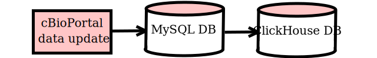
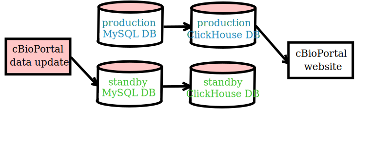
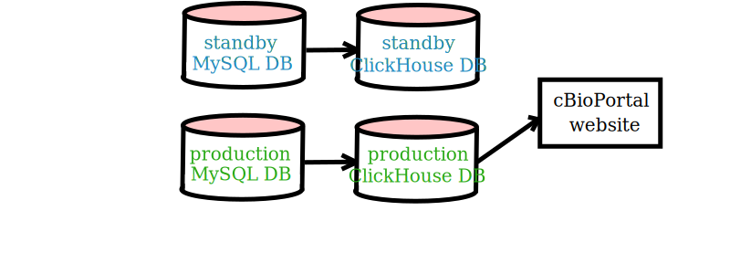

# cBioPortal Import Process Database Management Tools
These tools help manage database updates in cBioPortal deployments which include a
ClickHouse database. The data flow into clickhouse is currently accomplished
by using the pre-existing import process to import cancer study data into a mysql
database, then using these tools to tranfer the data into the ClickHouse
database and then deriving additional tables within clickhouse.



## High level data import strategy
The entire content of the MySQL database is replicated inside of clickhouse before
derived tables are constructed. Tools available to help with this process:

1. `drop_tables_in_clickhouse_database.sh` : any prior data in the clickhouse database
must be deleted before transferring the current database content. This script will drop
all tables from the clickhouse database.
1.  `copy_mysql_database_tables_to_clickhouse.sh` : the database content is copied from
the mysql database into the ClickHouse database. This script uses the standard
command line interface tool `Sling`.
1. `create_derived_tables_in_clickhouse_database.sh` : new tables are created and
populated with data from joins of various tables. These flattened derived tables
reduce response time for database queries made by the cBioPortal website.

## Direct update versus indirect update
When initially installing a deployment of the cBioPortal website, the databases can
be directly initialized and loaded with data before the web application is launched.
However, making updates to the databases of a running instance of cBioPortal which
is using ClickHouse as a data source can be disruptive. Installers should decide
whether or not they are able to tolerate a period of instability while the updates
are in progress. If they can, they can use the direct update approach:
1. make MySQL database alterations using the pre-existing methods for deleting /
importing / updating cancer studies
1. drop all tables in the clickhouse database
1. copy the content of the mysql database into clickhouse
1. create the derived tables in clickhouse
1. clear any persistence caches (if in use) (example: redis)
1. restart the cbioportal website deployment

Instability occurs because during the import process, the MySQL database tables
become discordant with the ClickHouse copies of those tables and the derived
ClickHouse tables. Part of the process is to drop all ClickHouse tables, so data
expected to be in the ClickHouse database will be unavailable while it is being
reconstituted.

If this disruption cannot be tolerated, installers can use the indirect update mode
supported by these tools. This strategy employs two MySQL databases and two
ClickHouse databases. These are distinguished with labels *blue* and *green*.
The *blue* databases include one of the MySQL databases and one of the ClickHouse
databases, and the *green* databases include the other MySQL database and the other
ClickHouse database. At any given time, one color will be active / in-production, and
the other color will be inactive / on-standby.

This arrangement allows the production databases to remain constant and stable for
the deployed cBioPortal website while updates are made in the standby databases.



when the update completes, the production datasource is switched to the other color



There are additional tools which are specific to this indirect update mode of
operations:
* `drop_tables_in_mysql_database.sh` : clears a mysql database
* `clone_mysql_database.sh` : copies the current content of the MySQL database from
one color to the other. The destination color database must be empty. Also note that
with the current implementation, the destination database must be on the same MySQL
server as the source database
* `set_update_process_state.sh` : maintains a state information table about which
database is currently in production, and whether or not an update is in progress
* `get_database_currently_in_production.sh` : determines which color database is
currently in-production by checking the state information table
* `synchronize_user_tables_between_databases.sh` : copies any users added during
an update process since cloning the mysql database into the upcoming production
database

Setting up an automated process for indirect updates would be dependent on your
deployment environment, and is beyond the scope of these tools. The order in which
steps occur is likely to be similar to:
1. set the update process state to "running"
1. clear the content of the standby MySQL DB
1. clone the content of the in-production MySQL DB to the standby MySQL DB
1. use pre-existing import methods to delete / import / update studies in the
standby MySQL DB
1. clear the content of the standby ClickHouse DB
1. copy the content of the standby MySQL DB into the standby Clickhouse DB
1. create the derived tables in the standby Clickhouse DB
1. syncronize any user entries added during the prior steps of the update
process from the in-production DB to the standby DB
1. clear any persistence caches (if in use) (example: redis)
1. restart/start-up a cBioPortal website deployment connected to the stanyby DBs
1. adjust your network so that traffic begins flowing to a deployed cBioPortal web
server connected to the newly prepared databases. (This causes the standby databases
to become the in-production databases)
1. set the update process state to "complete"

### State information for indirect update mode
To know which database to update and whether or not an update is already in progress,
a separate MySQL database is used. It holds a single table with a single record. That
record holds the current status in three fields:
* `update_status` : holds "running" when an update is underway, or else "complete"
* `time_of_last_update_process_completion` : holds an appropriate timestamp
* `current_database_in_production` : holds either "green" or "blue"

The tool `set_update_process_state.sh` accepts one of three values as its main input:
* "running" : used when first beginning the update process. If there is already an
uncompleted update process underway, the command will fail with an error.
* "complete" : used when a successful update process has completed. Running the tool
with this value should occur simultaneously with the action of making the new color
databases become the in-production databases for cBioPortal (such as when the load
balancer is changed to direct requests to a cBioPortal deployment connected to the
new color databases).
* "abandoned" : used when an update process has failed. The same color databases
remain in production, and the `update_status` field is reset to "complete".

## Dependencies
In the table below, dependencies are denoted with:
* B : `bash` command line shell (such as GNU bash, version 4.2.46)
* P : `python` interpreter (such as Python 3.7.16)
* S : `sling` data transfer tool (such as Version: v1.2.14)
* M : `mysql` db command line interface (such as mysql  Ver 15.1 Distrib 5.5.68-MariaDB)
* C : `clickhouse` command line interface (such as ClickHouse local version 24.5.1.1442)

| | | | | |tool|
|-|-|-|-|-|-|
|B| | |M| |`clone_mysql_database.sh`|
|B| |S|M| |`copy_mysql_database_tables_to_clickhouse.sh`|
|B|P| | |C|`create_derived_tables_in_clickhouse_database.sh`|
| |P| | | |`download_clickhouse_sql_scripts_py3.py`|
|B| | | |C|`drop_tables_in_clickhouse_database.sh`|
|B| | |M| |`drop_tables_in_mysql_database.sh`|
|B| | |M| |`get_database_currently_in_production.sh`|
|B| | |M| |`set_update_process_state.sh`|
|B| | |M|C|`synchronize_user_tables_between_databases.sh`|

Many tools here require use of a common properties file which contains database
connection settings and credentials. The provided
[template file](manage_cbioportal_databases_tool.properties) contains explanations
and instructions.

These provided bash function library files must be present in the same directory as
the tools:
* *mysql_command_line_functions.sh* contains functions for interacting with the
*mysql* command line interface.
* *sling_command_line_functions.sh* contains functions for interacting with the
*sling* command line interface.
* *clickhouse_client_command_line_functions.sh* contains functions for interacting
with the *clickhouse* command line interface.
* *parse_property_file_functions.sh* contains functions for parsing a *\*.properties* file.

Also, for the tools to function properly, databases must have already been created
and user privileges granted to allow the tool to make needed changes in the database.
If using the tool `clone_mysql_database.sh`, it is necessary that the two MySQL databases
(in-production and standby) be located on the same MySQL server.

If needed, creation of the table for tracking state information could be done with:
```
CREATE TABLE `update_status` (
  `current_database_in_production` varchar(256) DEFAULT NULL,
  `update_process_status` varchar(256) DEFAULT NULL,
  `time_of_last_update_process_completion` timestamp NULL DEFAULT NULL
)
```
And a record would need to be inserted which matches your current situation. Such as:
```
INSERT INTO `update_status` VALUES ('blue', 'complete', '2000-01-01 01:01:01')
```

## Details

#### copy\_mysql\_database\_tables\_to\_clickhouse.sh
Multiple retries are attempted on individual attempt failures. Copy results are
validated by record counts.

#### create\_derived\_tables\_in\_clickhouse\_database.sh
This takes in an ordered list of SQL files. It iterates through the SQL statements
sequentially. It calls *create_derived_tables_in_clickhouse_database_by_profile.py*
when processing the profiles for *genetic_alteration_derived* and
*generic_assay_data_derived*
